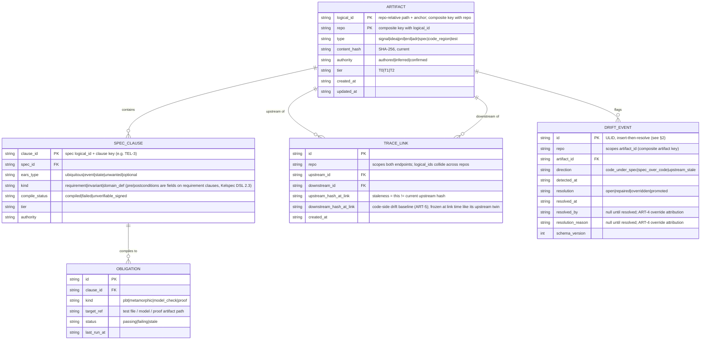
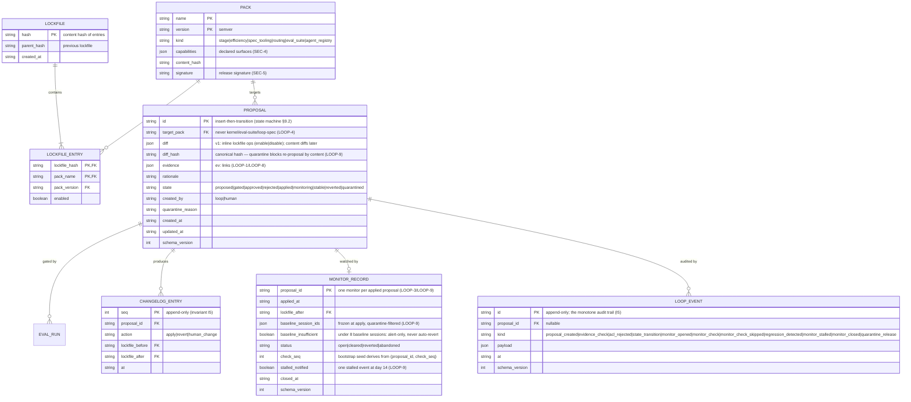
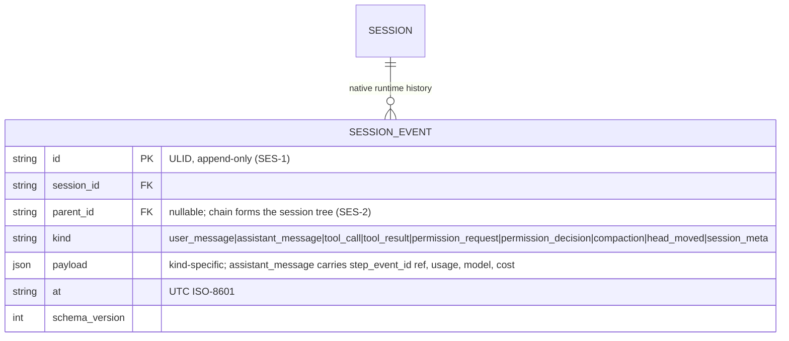
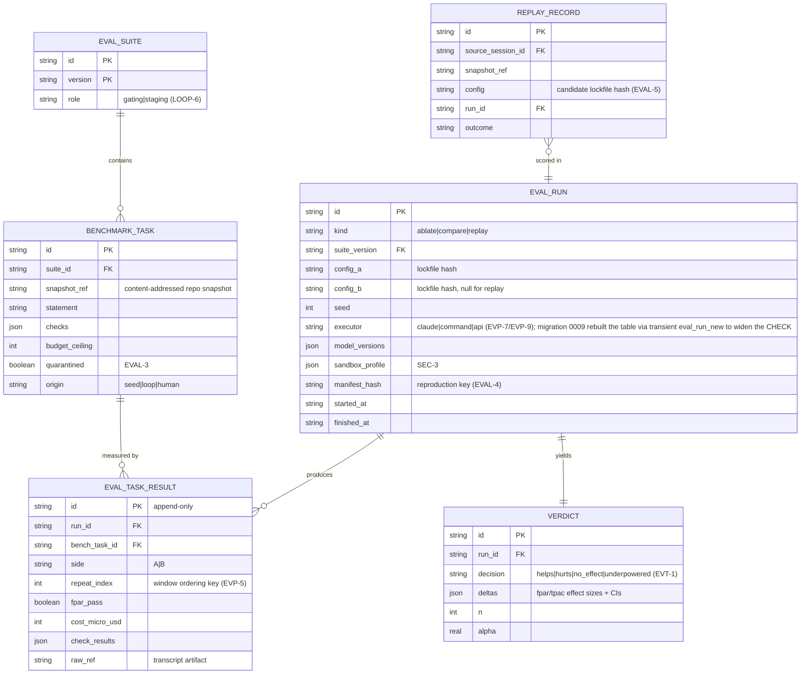
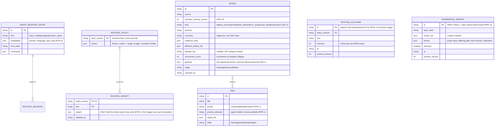

# ERD: Kelson Data Model

- **Status:** Draft for review
- **Date:** 2026-07-02
- **Upstream:** [PRD](./2026-07-02-agent-harness-prd.md) — entity requirements trace to PRD clause IDs noted per entity.
- **Implementation language:** TypeScript (see ADR-0001 for the language/storage decision record).

## 1. Storage Substrate

Three tiers, one rule each:

| Tier | Holds | Rule |
|---|---|---|
| **Git-tracked files** (in the target repo and in pack repos) | Specs/PRDs/ERDs/ADRs, spec clauses, packs (manifests, rules, routing policy structure, agent registry), lockfile, changelog, eval ledger | Anything a human reviews, a PR carries, or that must survive Kelson's removal is a file |
| **Local SQLite** (per operator, `~/.kelson/kelson.db`, WAL mode) | Sessions, tasks, step events, interventions, routing decisions, bundle/budget events, verification reports, eval runs/results/verdicts, replay records, drift events, routing weights, the artifact index | Anything measured, high-volume, or queried statistically lives in SQLite |
| **OTel projection** (optional, off by default; PRD TEL-6) | Traces/spans/metrics derived from SQLite-bound events at emit time | A projection, never a source of truth; content-stripped per TEL-3 |

The **artifact index** (hashes, trace links, staleness) is derived from files and rebuildable at any time (`kelson index rebuild`) — SQLite is disposable without losing anything a human authored.

## 2. Conventions

- **IDs:** ULIDs for event-like rows (sortable, no coordination). Artifacts use a stable logical ID (`repo-relative path + anchor`) plus a current `content_hash` (SHA-256); identity is the logical ID, versions are hashes.
- **Schema versioning (PRD OSS-6):** one `schema_migrations` table, forward-only migrations shipped with the CLI; every event row carries `schema_version`.
- **Types:** Zod schemas in `packages/schemas` are the single source of truth. TS types are inferred (`z.infer`), SQLite rows validated at the boundary, and JSON Schema is generated from Zod for the external signal contract (PRD §8.7) and the OTel attribute conventions.
- **Append-only tables** (`changelog` is a file, but `step_event`, `intervention_event`, `eval_task_result` are append-only in SQLite, enforced by BEFORE UPDATE/DELETE triggers): no UPDATE path in the data layer; corrections are new rows. `drift_event` is the exception — implementation surfaced that its `resolution`/`resolved_at` fields mutate in place as drift is resolved (ERD §3), so it is insert-then-resolve, not append-only.
- **Time:** UTC ISO-8601 strings (SQLite TEXT); durations in ms.
- **Money:** integer micro-USD (no floats in cost math).

## 3. Domain: Artifacts & Traceability

Implements PRD §6.4, §7 (ART-*, SPEC-*).

Notes: clauses are addressable sub-artifacts because traceability is clause-level (ART-1/2). `TRACE_LINK` freezes the upstream hash at link time; re-registering a downstream artifact **replaces** its trace links (hashes re-freeze at the new declaration) — trace_link is replace-on-register, not append-only; drift detection (ART-2/3) starts from every link where `upstream_hash_at_link ≠ current content_hash` and flags that link's **entire transitive downstream set** (recursive CTE, ADR-0002), run per session and on activation; code-side drift (ART-3/5) compares the downstream artifact's on-disk hash against `downstream_hash_at_link`, never against the rebuildable index's current hash. Drift events anchor on the link's **downstream** artifact in both directions; both-changed inserts two rows; an open `(repo, artifact_id, direction)` suppresses re-insert (ART-5). Files hold the authored content; these tables are the rebuildable index (§1).

## 4. Domain: Packs & Change Control

Implements PRD §5.3, §9 (LOOP-*), §14.2 (SEC-4..6).

Notes: `PACK`, `LOCKFILE`, and `CHANGELOG_ENTRY` are files (git-tracked; changelog is an append-only JSONL); rows here are index. `PROPOSAL.state` is exactly the §9.2 state machine — the TLA+ model and this enum must not drift (LOOP-5 conformance tests bind them). LOOP-4's protected-surface check is a constraint on `target_pack` enforced in the write path, not a prompt rule.

## 5. Domain: Telemetry

Implements PRD §6.1 (TEL-*, KERN-1), §12 (CTX-*), LOOP-7.

```mermaid
erDiagram
    SESSION ||--o{ STEP_EVENT : contains
    TASK ||--o{ STEP_EVENT : "routed as"
    TASK ||--o{ INTERVENTION_EVENT : receives
    TASK ||--o{ VERIFICATION_REPORT : produces
    TASK ||--o{ ROUTING_DECISION : "steps routed by"
    TASK ||--o{ BUNDLE_EVENT : "context from"
    BUNDLE_EVENT ||--o{ BUNDLE_MISS_EVENT : "on-demand loads"

    SESSION {
        string id PK "ULID"
        string repo
        string lockfile_hash FK "pinned at start (LOOP-7)"
        string harness_version
        int schema_version
        string status "complete|incomplete|degraded"
        string runner "cc|native, nullable — pre-0008 rows null (SES-5)"
        string trace_id "OTel correlation (TEL-6)"
        string started_at
        string ended_at
    }
    TASK {
        string id PK
        string repo
        json spec_clause_refs
        string state "open|in_progress|delivered|accepted|corrected|abandoned (TEL-7)"
        string acceptance_signal "approval|merge_clean|null"
        int correction_count "count of correction-class interventions (TEL-4), maintained at ingestion"
        string opened_at
        string delivered_at
        string closed_at
    }
    STEP_EVENT {
        string id PK "ULID, append-only"
        string task_id FK
        string session_id FK
        string sdlc_step "feedback|ideation|planning|spec|build|verify"
        string model
        string effort
        string agent_id FK
        int tokens_in
        int tokens_out
        int tokens_cache_read
        int tokens_cache_write
        json unit_prices "price snapshot at execution (cost normalization, PRD 3); keys are lowercase identifier tokens (^[a-z][a-z0-9_.:-]*$) — never arbitrary strings"
        int cost_micro_usd "nullable: NULL = price unknown at ingest (PROV-3, never estimated); migration 0007 rebuilt the table via transient step_event_new to drop NOT NULL"
        int budget_tokens
        string overrun "none|soft|paused (CTX-4)"
        string span_id "OTel correlation"
        int schema_version
    }
    INTERVENTION_EVENT {
        string id PK "ULID, append-only"
        string task_id FK
        string session_id FK
        string class "correction|clarification|approval (TEL-4)"
        string artifact_hash "what it concerns"
        string at
        int schema_version
    }
    ROUTING_DECISION {
        string id PK "append-only"
        string task_id FK
        string step_id
        int attempt "0 = initial; escalations increment (RTR-2)"
        string kind "initial|escalation"
        json feature_vector "RTR-1"
        int rule_index "-1 = default rule (RPOL-1)"
        string matched_by "rule|capability — capability match overrides the rule target (RTR-4)"
        string target FK
        string effort
        json loadout
        int budget_tokens "CTX-4"
        json escalation "remaining ladder"
        string policy_hash "canonical policy content hash"
        boolean regret "escalation = the RTR-2 regret event"
        string at
        int schema_version
    }
    BUNDLE_EVENT {
        string id PK "append-only (CTX-1)"
        string task_id FK
        string tokenizer "pinned identity (CTX-5)"
        int token_count "whole-text tokenization of the assembled bundle (CTX-5)"
        json manifest "kind, ref, hash, tokens per section — the verification route"
        string at
        int schema_version
    }
    BUNDLE_MISS_EVENT {
        string id PK "append-only; on-demand loads join the accounting (CTX-1)"
        string bundle_id FK
        string ref
        int tokens "tokenization of the delivered content"
        string at
        int schema_version
    }
    BUDGET_EVENT {
        string id PK "append-only; ordering by rowid — ULIDs tie within 1ms (F-060)"
        string step_id
        string kind "overrun|triage_requested|triage_resolved (RPOL-6)"
        json payload "attribution on overrun; action/actor/reason on resolution"
        string at
        int schema_version
    }
    VERIFICATION_REPORT {
        string id PK
        string task_id FK
        json results "per check class (PIPE-8)"
        string failure_class "code_defect|spec_defect|obligation_defect|null (PIPE-9)"
        string at
    }
```

Notes: `TASK` is deliberately not owned by `SESSION` — tasks resume across sessions; `STEP_EVENT` carries both FKs, so FPAR joins tasks to configs through sessions' pinned lockfiles. Price snapshots are denormalized onto `STEP_EVENT` so historical cost math never depends on a mutable price table.

### Native runtime session events (Phase 6, SES-*)

Append-only, no UPDATE/DELETE (SES-1); reads order by `rowid`. The current head is derived from the latest `head_moved` event by rowid — there is no mutable head column (SES-3). Forks (Phase 10) are two events sharing a `parent_id`. `SESSION` carries a nullable `runner` column (`cc|native`, migration 0008, SES-5): `startSession` writers stamp their runner; pre-0008 rows read back null.

## 6. Domain: Eval

Implements PRD §6.2 (EVAL-*), §10 (EVT-*), §14.1 (SEC-1..3).

The public **eval ledger** (EVT-3) is a git-tracked file per pack version: `{pack, version, manifest_hash, verdict summary, date}` — reproducible via `EVAL_RUN.manifest_hash`.

## 7. Domain: Routing & Signals

Implements PRD §6.3 (RTR-*), §11, §8.1 (PIPE-1).

The RTR-5 write-surface rule is structural here: the bandit's entire write access is the `ROUTING_WEIGHT.weight` column; policy *structure* is a pack file changed only via proposals.

## 8. OTel Projection (TEL-6)

| Kelson entity | OTel mapping |
|---|---|
| `SESSION` | Trace (`trace_id` stored on the row) |
| `STEP_EVENT` | Span — attributes: `kelson.sdlc_step`, `kelson.model`, `kelson.effort`, `kelson.agent`, token counts, `kelson.cost_micro_usd`, `kelson.budget.overrun` |
| `INTERVENTION_EVENT`, `DRIFT_EVENT`, routing escalations | Span events on the enclosing step span |
| Metrics | `kelson.fpar`, `kelson.tpac`, `kelson.overhead_ratio`, `kelson.routing.regret`, counters: `kelson.drift.count`, `kelson.interventions.count`, `kelson.eval.gate.{pass,reject}` |

Exporter is OTLP, disabled unless an endpoint is configured; all attributes pass the TEL-3 content-stripping rules (numeric/categorical only — no prompts, paths, or code).

## 9. TypeScript Stack & Package Layout

- **Runtime:** Bun ≥ 1.3, ESM, TypeScript strict (typecheck via `tsc --noEmit`; ADR-0003). Kernel/schemas code stays runtime-agnostic — `Bun.*` APIs only behind a thin sqlite adapter.
- **Monorepo (Bun workspaces):**
  - `packages/schemas` — Zod schemas for every entity above + generated JSON Schema (signal contract, OTel conventions). No dependencies on other packages; everything depends on it.
  - `packages/kernel` — telemetry, eval harness, router, artifact store as internal modules behind one public API; owns SQLite (`bun:sqlite`) and migrations. Never imports `agent` — the api executor is injected via `runEval`'s `extraExecutors` (ADR-0004).
  - `packages/agent` — the native runtime (Phase 6+): AI SDK provider layer (auth, model registry, cost), step loop, core tools, permission engine, session-event store. Depends on kernel + schemas.
  - `packages/cli` — `kelson` command: eval runner, replay engine, index rebuild, agents/loop/route subcommands, chat/run surfaces. Sandboxing lives here (worktree + container drivers). Composition root: wires `apiExecutor` into `runEval`.
  - `packages/cc-plugin` — the Claude Code plugin (skills, hooks, subagents) — the only Claude Code-coupled package (PRD §5.4 migration criteria depend on this boundary).
- **Testing:** `bun test`; fast-check for Kelson's own PBT obligations (the PRD's *Obligation* lines compile into this suite); TLA+ models under `specs/tla/` checked in CI (TLC via container).
- **No ORM:** `bun:sqlite` with hand-written SQL and Zod validation at the boundary; migrations are numbered SQL files applied forward-only (OSS-6).

## 10. Open Questions

1. ~~Repo snapshot mechanism for `snapshot_ref`~~ — resolved: git bundles stored content-addressed under `~/.kelson/snapshots/` ([Eval procedure spec](./2026-07-02-eval-procedure.md) §4).
2. Whether `ROUTING_WEIGHT` needs per-repo partitioning (same policy, different repos) — defer until telemetry shows repo-level divergence.
